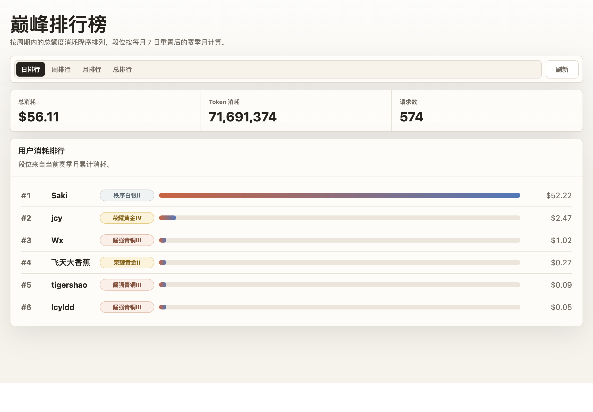
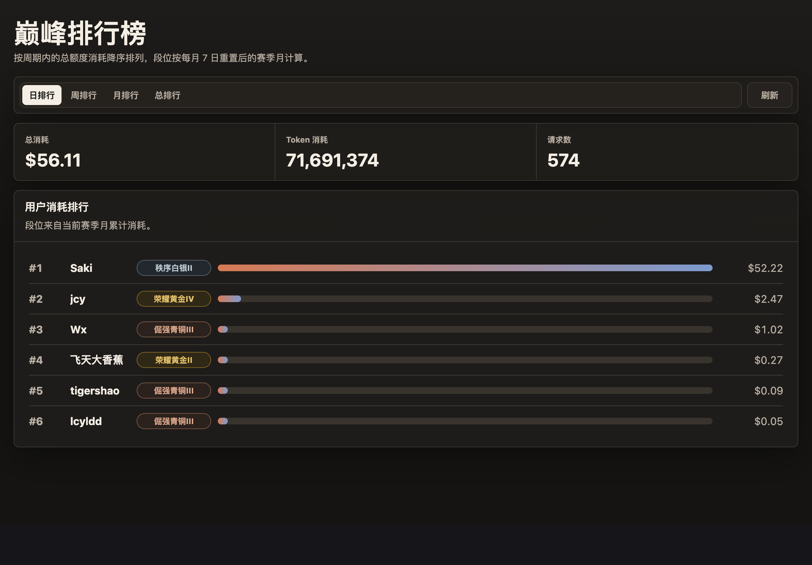
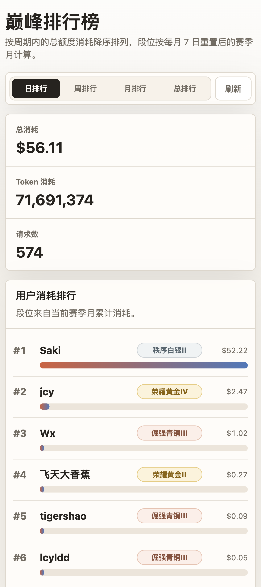
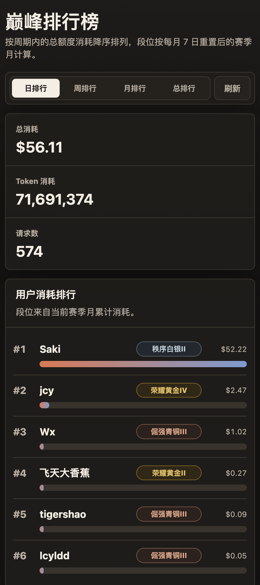

# New API 外挂用户排行榜 / New API Rank Add-on

独立排行榜页面和代理服务，不修改 New API 原项目。

An independent ranking page and proxy service for New API, designed to run without modifying the upstream New API project.

## 效果预览 / Preview

| 桌面端浅色 / Desktop Light | 桌面端深色 / Desktop Dark |
| --- | --- |
|  |  |

| 移动端浅色 / Mobile Light | 移动端深色 / Mobile Dark |
| --- | --- |
|  |  |

## 启动 / Getting Started

先按实际环境修改项目根目录的 `config.json`：

Edit `config.json` in the project root for your environment first:

```json
{
  "server": {
    "port": 2234
  },
  "newApi": {
    "baseUrl": "http://127.0.0.1:2233",
    "authorization": "Bearer <your-admin-token>",
    "adminUserId": "1"
  },
  "rank": {
    "timezone": "Asia/Shanghai",
    "utcOffsetMinutes": 480,
    "seasonResetDay": 7
  }
}
```

本地启动：

Start locally:

```bash
npm start
```

打开：

Open:

```text
http://localhost:2234/rank-addon/users
```

如果要复用 New API 网页登录态，生产环境建议把外挂服务反向代理到 New API 同域名下，例如：

To reuse the New API web login session, reverse proxy the add-on under the same domain as New API in production, for example:

```text
https://xxx.aaa.bb/rank-addon/* -> http://127.0.0.1:2234/rank-addon/*
```

这样浏览器会自动携带 New API 的 Cookie，外挂服务才能用 `/api/user/self` 校验登录态。

This lets the browser send the New API cookies automatically, so the add-on can verify the login session through `/api/user/self`.

## 配置 / Configuration

- `server.port`：外挂服务端口，默认 `2234`
  `server.port`: add-on service port, default `2234`
- `newApi.baseUrl`：New API 地址，默认 `http://localhost:2233`
  `newApi.baseUrl`: New API base URL, default `http://localhost:2233`
- `newApi.authorization`：服务端请求 `/api/data/users` 时使用的管理员 `Authorization`
  `newApi.authorization`: admin `Authorization` used by the server when requesting `/api/data/users`
- `newApi.adminUserId`：服务端请求 `/api/data/users` 时使用的管理员 `New-Api-User`
  `newApi.adminUserId`: admin `New-Api-User` used by the server when requesting `/api/data/users`
- `rank.timezone`：排行口径的时区说明，默认 `Asia/Shanghai`
  `rank.timezone`: timezone label for ranking windows, default `Asia/Shanghai`
- `rank.utcOffsetMinutes`：排行口径的 UTC 偏移分钟数，上海时区为 `480`
  `rank.utcOffsetMinutes`: UTC offset in minutes for ranking windows, `480` for Asia/Shanghai
- `rank.seasonResetDay`：赛季月每月几号重置，当前为 `7`
  `rank.seasonResetDay`: day of month when the season month resets, currently `7`

`PORT`、`NEW_API_BASE`、`NEW_API_AUTHORIZATION`、`NEW_API_USER`、`RANK_TIMEZONE`、`RANK_UTC_OFFSET_MINUTES`、`RANK_SEASON_RESET_DAY` 仍可作为临时环境变量覆盖配置，但 systemd 部署默认只读 `config.json`。

`PORT`, `NEW_API_BASE`, `NEW_API_AUTHORIZATION`, `NEW_API_USER`, `RANK_TIMEZONE`, `RANK_UTC_OFFSET_MINUTES`, and `RANK_SEASON_RESET_DAY` can still override the config for one-off runs, while the systemd deployment reads `config.json` by default.

访问排行榜接口时，外挂服务会先把浏览器传入的 New API Cookie 转发到 `/api/user/self` 校验登录态。未登录用户只能看到页面骨架，不能获取排行榜数据。

When the ranking API is requested, the add-on first forwards the browser's New API cookies to `/api/user/self` to verify the login session. Logged-out users can see the page shell but cannot fetch ranking data.

## 接口 / API

```text
GET /rank-addon/api/users?period=day&page_size=100
```

`period` 支持 `day`、`week`、`month`、`all`，分别对应日排行、周排行、月排行和总排行。其中 `month` 不是自然月，而是每月 7 日 00:00 重置的赛季月。页面默认请求 `page_size=100`，然后在浏览器里按滚动位置逐批展示；接口本身仍支持最多返回 100 个用户。返回数据已按用户 ID 聚合并按总 `quota` 降序排序，展示名取该用户数据中最新的 `username`，每行会包含按当前赛季月消耗计算的 `tier` 段位字段。

`period` supports `day`, `week`, `month`, and `all`, corresponding to daily, weekly, monthly, and all-time rankings. `month` is a season month that resets at 00:00 on the 7th day of each month, not a calendar month. The page requests `page_size=100` by default and reveals rows progressively while scrolling. The API itself still returns up to 100 users. Response rows are aggregated by user ID, sorted by total `quota` in descending order, display the latest `username` found for that user, and each row includes a `tier` field calculated from the current season-month usage.

周排行按 `rank.utcOffsetMinutes` 对应时区的自然周统计，默认使用 `Asia/Shanghai` 口径，即周一 00:00 到当前请求时间。

The weekly ranking uses the natural week in the timezone represented by `rank.utcOffsetMinutes`. By default, it follows `Asia/Shanghai`, from Monday 00:00 to the current request time.

段位换算使用 0-1520 刀对应 0-200 星：前 100 星对应青铜到星耀，100 星后进入王者细分，1520 刀对应传奇王者 100 星。页面展示使用 `至尊星耀III`、`最强王者⭐3` 这种格式；只有王者段位显示星数。

Tier conversion maps 0-1520 USD to 0-200 stars. The first 100 stars cover Bronze through Star Glory, and stars after 100 enter King sub-tiers, with 1520 USD mapping to Legendary King 100 stars. The UI uses formats such as `至尊星耀III` and `最强王者⭐3`; only King tiers show star counts.

## 致谢 / Acknowledgements

感谢 [LinuxDo](https://linux.do/) 社区在使用反馈、部署实践和体验改进上的讨论与支持。

Thanks to the [LinuxDo](https://linux.do/) community for its feedback, deployment experience, and discussions that helped improve the user experience.
