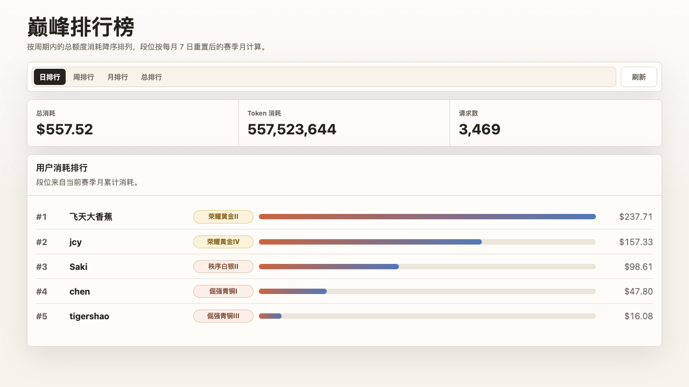
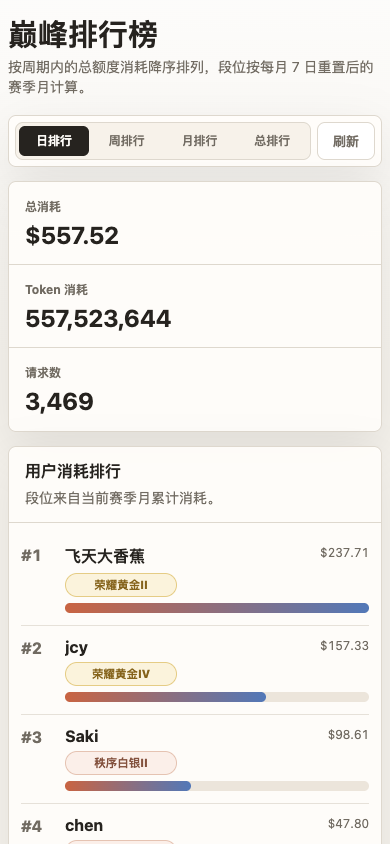

# New API 外挂用户排行榜

独立页面和代理服务，不修改 New API 原项目。

## 效果预览





## 启动

先按实际环境修改项目根目录的 `config.json`：

```json
{
  "server": {
    "port": 2234
  },
  "newApi": {
    "baseUrl": "http://127.0.0.1:2233",
    "authorization": "Bearer <your-admin-token>",
    "adminUserId": "1"
  },
  "rank": {
    "timezone": "Asia/Shanghai",
    "utcOffsetMinutes": 480,
    "seasonResetDay": 7
  }
}
```

本地启动：

```bash
npm start
```

打开：

```text
http://localhost:2234/rank-addon/users
```

如果要复用 New API 网页登录态，生产环境建议把外挂服务反向代理到 New API 同域名下，
例如：

```text
https://xxx.aaa.bb/rank-addon/* -> http://127.0.0.1:2234/rank-addon/*
```

这样浏览器会自动携带 New API 的 Cookie，外挂服务才能用 `/api/user/self`
校验登录态。

## 配置

- `server.port`：外挂服务端口，默认 `2234`
- `newApi.baseUrl`：New API 地址，默认 `http://localhost:2233`
- `newApi.authorization`：服务端请求 `/api/data/users` 时使用的管理员 `Authorization`
- `newApi.adminUserId`：服务端请求 `/api/data/users` 时使用的管理员 `New-Api-User`
- `rank.timezone`：排行口径的时区说明，默认 `Asia/Shanghai`
- `rank.utcOffsetMinutes`：排行口径的 UTC 偏移分钟数，上海时区为 `480`
- `rank.seasonResetDay`：赛季月每月几号重置，当前为 `7`

`PORT`、`NEW_API_BASE`、`NEW_API_AUTHORIZATION`、`NEW_API_USER`、
`RANK_TIMEZONE`、`RANK_UTC_OFFSET_MINUTES`、`RANK_SEASON_RESET_DAY`
仍可作为临时环境变量覆盖配置，但 systemd 部署默认只读 `config.json`。

访问排行榜接口时，外挂服务会先把浏览器传入的 New API Cookie 转发到
`/api/user/self` 校验登录态。未登录用户只能看到页面骨架，不能获取排行榜数据。

## 接口

```text
GET /rank-addon/api/users?period=day&page_size=100
```

`period` 支持 `day`、`week`、`month`、`all`，分别对应日排行、周排行、月排行和总排行。
其中 `month` 不是自然月，而是每月 7 日 00:00 重置的赛季月。页面默认请求
`page_size=100`，然后在浏览器里按滚动位置逐批展示；接口本身仍支持最多返回
100 个用户。返回数据已按用户聚合并按总 `quota` 降序排序，每行会包含按当前
赛季月消耗计算的 `tier` 段位字段。

周排行通常统计最近 7 天；如果当前处于赛季开始后的第一周，周排行起点会钳制到
赛季开始日，避免统计上个赛季的数据。

段位换算使用 0-1520 刀对应 0-200 星：前 100 星对应青铜到星耀，
100 星后进入王者细分，1520 刀对应传奇王者 100 星。页面展示使用
`至尊星耀III`、`最强王者⭐3` 这种格式；只有王者段位显示星数。
